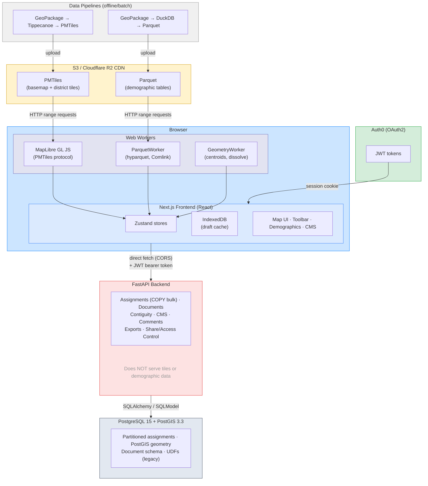

# Architecture Overview

Districtr v2 is a community redistricting platform that lets users draw and evaluate electoral district maps interactively in the browser. The system is a monorepo with four main components.

## System Diagram

### Key wiring details

- **Tiles & Parquet bypass the backend entirely.** The browser fetches PMTiles and Parquet directly from S3/R2 CDN using HTTP range requests. The backend does not provide geospatial data directly, but it has a canonical copy of GerryDB data used to find missing assignments and perform other geospatial data validation steps.
- **No Next.js API proxy.** The browser makes direct CORS requests to FastAPI with Auth0 JWT tokens in headers.
- **Auth0 session managed by Next.js.** The Next.js server handles OAuth2 login/callback and stores the JWT in an httpOnly session cookie. Client-side code extracts the token for API requests.
- **IndexedDB is a local draft cache**, not a sync layer. Debounced writes store in-progress assignments; the server remains source of truth via optimistic concurrency (`updated_at`).
- **Pipelines are offline/batch.** They produce static artifacts (PMTiles, Parquet) uploaded to S3. No runtime connection to the backend.

## Frontend (`app/`)

**Stack**: Next.js 16, TypeScript, Bun, MapLibre GL JS, Zustand, IndexedDB (Dexie)

### Routing

- `(interactive)/map/[map_id]` - Map viewer; `(interactive)/map/edit/[map_id]` - Map editor
- `(static)/` - Landing, about, guide, places, portals, tags, changelog
- `admin/` - Auth0-protected CMS and admin panels

### State Management

Zustand stores with composed middleware (persist → devtools → temporal → subscribeWithSelector):

| Store | Purpose |
|-------|---------|
| `mapStore` | Central document state, map refs, loading, zone comments, shatter state |
| `assignmentsStore` | Zone assignments, spatial paint operations, unassigned features |
| `mapControlsStore` | Active tool, pan/zoom, interaction mode |
| `demography/demographyStore` | Demographic display and caching |
| `temporalStore` | Undo/redo via Zundo |
| `saveShareStore` | Save/share workflow |

Cross-store side effects are coordinated via explicit subscriptions in `store/subscriptions.tsx`, `store/mapEditSubs.ts`, and `store/metricsSubs.ts`, not component-level listeners.

### Web Workers

- **GeometryWorker** - Centroids, dissolve, geometry calculations (via Comlink)
- **ParquetWorker** - Parquet file reading, columnar data extraction (via Comlink)
- Both use IndexedDB caching and explicit lifecycle management

### Persistence

IndexedDB serves as offline cache and conflict resolution source. Debounced writes for rapid paint updates; immediate flush before navigation. Server is source of truth; IDB enables optimistic concurrency with `updated_at` conflict detection.

## Backend (`backend/`)

**Stack**: FastAPI, Python 3.12, SQLModel/SQLAlchemy, Alembic, PostGIS, Auth0

### Core Models

| Model | Purpose |
|-------|---------|
| `DistrictrMap` | Map metadata (slug, layers, tiles path, num_districts, visibility) |
| `Document` | Map document instance (UUID, auto-increment public_id, metadata JSON) |
| `Assignments` | Partitioned table: document_id → partition, geo_id → zone mapping |
| `GerryDBTable` | Reference to loaded geospatial data layers |
| `ParentChildEdges` | Shatter topology: parent-child geometry nesting (partitioned) |

### Key API Patterns

- **Bulk assignments**: `PUT /api/assignments` uses PostgreSQL COPY for performance with optimistic concurrency
- **Shatter operations**: `PATCH /api/assignments/{doc_id}/shatter` handles parent → child decomposition
- **Contiguity**: Graph-based checking via NetworkX
- **Auth**: Auth0 JWT with scopes (default/editor/admin), reCAPTCHA for public forms

### Database Design

- Schema isolation: `public` for maps/references, `document` schema for document-specific tables
- Table partitioning on `document_id` for Assignments and ParentChildEdges
- PostGIS geometry columns for spatial queries
- **SQLAlchemy-first policy**: No new UDFs; existing UDF paths are legacy

### Migrations

Alembic with 50+ versions. UDF handling stores previous definitions under `sql/versions/{down_revision}/` for downgrade support. Auto-migrated on deploy via Fly.io release command.

## Pipelines (`pipelines/`)

**Stack**: Python, Tippecanoe, DuckDB, OGR2OGR, GDAL

### Data Flow

1. **Input**: GeoPackage files (from GerryDB or external sources)
2. **Tileset generation**: `ogr2ogr` → `tippecanoe` → PMTiles
3. **Tabular data**: GeoPackage → DuckDB → Parquet
4. **Graph build**: child + parent GeoPackage → dual-level NetworkX graph pkl
5. **Upload**: Artifacts pushed to S3/Cloudflare R2
6. **Consumption**: Frontend loads PMTiles (map tiles) and Parquet (demographics)
   directly from R2; backend loads graph pkls for contiguity checks and store locally

### CLI Commands

- `tileset create-gerrydb-tileset` - Generate PMTiles from GeoPackage
- `tileset merge-gerrydb-tilesets` - Combine parent+child for shatterable maps
- `tabular build-parquet` / `batch-build-parquet` - Parquet generation for demographic data
- `transforms aggregate` - Aggregate block-level data to higher geographies
- `transforms create-graph` - Build a dual-level graph pkl from two GeoPackage files
- `transforms batch-create-graphs` - Batch build graph pkls from a config file

### Batch Config Files

Batch configs live in each sub-package's `configs/` directory and drive repeatable runs:

| Config | Purpose |
|--------|---------|
| `tilesets/configs/v1_tileset_config.yml` | PMTiles for all v1 state maps |
| `tilesets/configs/vap_and_election.yml` | PMTiles for older non-v1 maps |
| `tabular/configs/v1_tabular_config.yml` | Parquet for all v1 state maps |
| `tabular/configs/vap_and_election.yml` | Parquet for older non-v1 maps |
| `transforms/configs/v1_graph_config.yml` | Graph pkls for all 51 v1 shatterable maps |
| `transforms/configs/vap_and_election.yml` | Graph pkls for 10 older shatterable maps |

Graph pkls are stored at `S3_BUCKET/graphs/<gerrydb_table_name>.pkl` and loaded at runtime by the backend contiguity endpoints.

## Infrastructure

### Local Development

Docker Compose with 5 services: `db` (PostGIS), `backend` (Uvicorn), `frontend` (Bun dev), `pre-commit` (linting), `pipelines`. Hot reload via bind mounts.

### Production (Fly.io)

- **Frontend**: 1GB RAM, 1 shared CPU, EWR region
- **Backend**: 8GB RAM, 4 shared CPUs, 10GB persistent volume, EWR region
- Release command runs `alembic upgrade head` before backend startup
- Tilesets and Parquet served from Cloudflare R2

### CI/CD (GitHub Actions)

- `fly-deploy-app.yml` / `fly-deploy-api.yml` - Deploy on push to `main`/`dev`
- `test-backend.yml` - pytest against PostGIS on backend changes

## Key Architectural Decisions

1. **Server-centric computation** - Metrics, contiguity, and spatial operations run server-side, not in tiles
2. **Partitioned assignments** - Per-document table partitions for isolation and scale
3. **Optimistic concurrency** - `updated_at` timestamps for conflict detection; IDB as local cache
4. **Subscription-based sync** - Cross-store effects via explicit subscriptions, not ad hoc listeners
5. **Worker offloading** - Heavy geometry and data parsing in Web Workers to keep UI responsive
6. **Map lock protocol** - UI respects `mapLock` state to prevent conflicting operations during saves/loads
7. **Shatterable maps** - Parent-child geometry nesting enables drill-down from precincts to blocks
