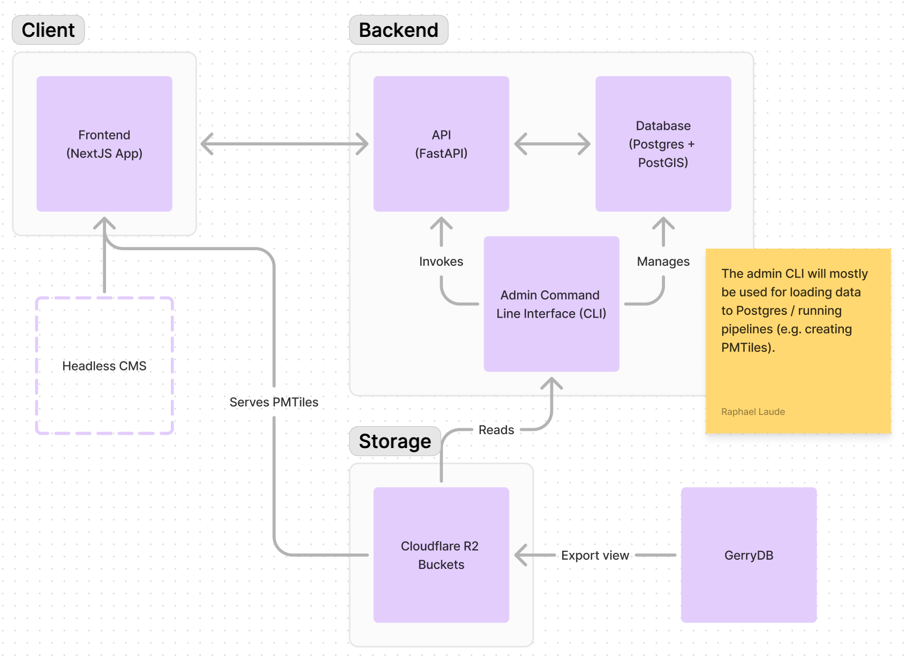

The Districtr reboot monorepo.

## Repo organization

- [`app`](app/): The rebooted Districtr app, NextJS/React Typescript app.
- [`backend`](backend/): FastAPI/Python API.
- [`pipelines`](pipelines/): Data pipelines, ETL. Not a main focus of the reboot. For now, will mostly contain scratch data transformation scripts before being integrated into the backend CLI.
- [`prototypes`](prototypes/): Prototypes conducted as part of the reboot.

## Quickstart
The backend (Python), frontend (NextJS), and database (postgres) can be run locally using Docker.

- Install and configure [Docker](https://www.docker.com/) for your machine
- Copy `app/.env.dev` to `app/.env`  and `backend/.env.dev` to `backend/.env`
- From the repo root, run `docker-compose up --build`
- In `backend/.env`, the variable `LOAD_GERRY_DB_DATA` indicates whether or not to load in local geopackage data. A basic exmaple has been provided; to load additional geographies that have already been processed into tilesets, add the relevant geopackage files to `sample_data`

## Districtr reboot architecture

After experimenting with various technologies (see [`prototypes`](prototypes/)) we landed on the following architecture for the Districtr reboot:

The redesign aims to principally to address three key pain points in the Districtr application’s performance and maintainability:
1. Slow tile rendering
1. Cumbersome use of tiles as global state for tile rendering and most metric calculation
1. Complexity and poor interoperability in architecture without slow copies

And two key feature additions
1. Block “shattering”
1. A headless CMS (this will be added in a later phase of work / is not currently a focus of the reboot)

The principal difference with the existing Districtr application is that the server is responsible for a lot more work in this architecture, with most metric calculations performed server-side.
We discuss how centralizing/consolidating the backend offers a number of advantages for dealing with pain points listed above.

Compared to the existing Districtr application, the proposed architecture allows for GerryDB views to be loaded as tables into Districtr, and map tiles can be created downstream through this pipeline.
This shifts the onus of the tiles as data store to a performant database and allows the tiles to specifically serve as the basis for map rendering and user interaction, providing a faster client-side experience.

## Developer set-up and conventions

Shared set-up / configuration across monorepo.

### Python

Dependencies are managed with [uv](https://github.com/astral-sh/uv). Follow their setup instructions [here](https://github.com/astral-sh/uv/blob/main/README.md).

This project is formatted with ruff using pre-commit hooks. Make sure [pre-commit](https://pre-commit.com/) and [ruff](https://pypi.org/project/ruff/) are intalled then run `pre-commit install` in the root directory.

Test that the pre-commit hooks are working by running `pre-commit run --all-files`.

### Pull request reviews

All PRs must have at least one approving review before being merged and pass all CI/CD checks / GHAs.

When reviewing a PR, use the "HIPPO" method to provide feedback:
| Letter | Meaning |
| --- | --- |
| **H** - High / hold-up | Changes requested in order to be merged. |
| **I** - Important or improvement | Changes requested. Possibly blocking but more opinion-based than **H**. Reviewer should provide specifics as to why this is an improvement. |
| **PP** - Personal preference | Possible changes requested. Something the reviewer would do but is non-blocking. |
| **O** - Opinion | Comment for discussion. Non-blocking. Could be a bigger idea that's relevant to the PR. |

### CI/CD

Deployments are managed with GitHub Actions.
