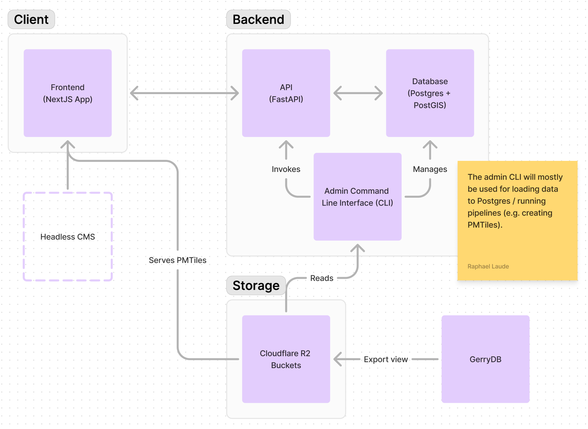

The Districtr reboot monorepo.

## Repo organization

- [`app`](app/): The rebooted Districtr app, NextJS/React Typescript app.
- [`backend`](backend/): FastAPI/Python API.
- [`pipelines`](pipelines/): Data pipelines, ETL. Not a main focus of the reboot. For now, will mostly contain scratch data transformation scripts before being integrated into the backend CLI.
- [`prototypes`](prototypes/): Prototypes conducted as part of the reboot.

## Quickstart

The backend (Python), frontend (NextJS), and database (postgres) can be run locally using Docker.

1. Install and configure [Docker](https://www.docker.com/) for your machine
1. `cp ./backend/.env.docker.example && ./backend/.env.docker` and fill in missing variables.
1. From the repo root, run `docker-compose up`
1. Add data as necessary by following the steps in [Loading data](#loading-data) below

### Make shortcuts

From the repo root, you can also use:

- `make dev` for the default full-stack dev container (`db`, `fullstack`)
- `make prod` for the full-stack prod-like container (`db`, `fullstack-prod`)
- `make playwright` to start prod-like services and run Playwright from host

### Loading data

The default build will not load any data. To load data, create a `.env` in the repo root set `LOAD_DATA=true`. Alternatively, shell env vars will be given priority so you can run `LOAD_DATA=true docker-compose up db backend frontend`. (You can [double-check your configuration](https://docs.docker.com/compose/how-tos/environment-variables/variable-interpolation/) is picking up the env var with `docker compose config`.)

By default the script will attempt to pull data from `s3://districtr-v2-dev/gerrydb/`. You can change where the script looks for available data with the `GPKG_DATA_DIR` variable.

## Dev Containers

The Docker Compose services can also be used as [Dev Containers](https://containers.dev/), giving you a fully configured IDE experience with extensions, linting, formatting, and debugging pre-configured. The services start normally — dev containers just attach your editor to the running container.

### Prerequisites

1. Install and configure [Docker](https://www.docker.com/)
2. Copy environment files:
   ```bash
   cp ./backend/.env.docker.example ./backend/.env.docker
   cp ./app/.env.docker.example ./app/.env.docker
   ```
   Fill in any missing variables in both files.

### Available containers

| Container | Services started | Workspace | Ports | Mode |
| --- | --- | --- | --- | --- |
| **Districtr Full-Stack** | `fullstack`, `db` | `/workspace` | 3000, 8000 | Dev (hot reload) |
| **Districtr Full-Stack (Prod)** | `fullstack-prod`, `db` | `/workspace` | 3000, 8000 | Prod (optimized build) |

Both containers include Python and TypeScript/React tooling with syntax highlighting, linting, and formatting for both languages. The **Full-Stack** container (default) runs migrations, starts uvicorn with `--reload`, and runs the Next.js dev server. The **Full-Stack (Prod)** container runs a production Next.js build and serves it with `bun run start`.

### VS Code

1. Install the [Dev Containers](https://marketplace.visualstudio.com/items?itemName=ms-vscode-remote.remote-containers) extension
2. Open the repo in VS Code
3. When prompted, click **Reopen in Container** — or run the command **Dev Containers: Reopen in Container** from the command palette
4. Choose **Districtr Full-Stack** (dev) or **Districtr Full-Stack (Prod)**

Both containers include launch configurations for debugging FastAPI, running the current file, and pytest — accessible from the Run and Debug panel.

### Zed

Zed has built-in dev container support (no extension needed).

1. Open the repo in Zed
2. Run **Dev Containers: Reopen in Dev Container** from the command palette (`cmd+shift+p`)
3. Select the desired container

> **Note:** Zed does not currently support VS Code extensions, so the pre-configured extensions (Ruff, Prettier, SQLTools, etc.) won't be installed. Zed's own language support for Python and TypeScript will be used instead. The `customizations.vscode` settings in `devcontainer.json` are ignored by Zed.

### Container modes

Both containers mount `backend/` and `app/` under `/workspace` and include all extensions for both languages.

- **Full-Stack** (default) — dev mode. Runs `alembic upgrade head`, starts uvicorn with `--reload`, and runs `bun run dev` for the Next.js dev server with hot reload.
- **Full-Stack (Prod)** — prod-like mode. Runs `alembic upgrade head`, starts uvicorn, builds the Next.js app, and serves it with `bun run start`.

The legacy single-service containers (`backend`, `frontend`, `frontend-prod`) are still available via profiles for CI or targeted use:

```bash
docker compose --profile backend up db backend
docker compose --profile frontend up frontend
```

## Districtr reboot architecture

After experimenting with various technologies (see [`prototypes`](prototypes/)) we landed on the following architecture for the Districtr reboot:



The redesign aims to principally to address three key pain points in the Districtr application’s performance and maintainability:

1. Slow tile rendering
1. Cumbersome use of tiles as global state for tile rendering and most metric calculation
1. Complexity and poor interoperability in architecture without slow copies

And two key feature additions

1. Block “shattering”
1. A headless CMS (this will be added in a later phase of work / is not currently a focus of the reboot)

The principal difference with the existing Districtr application is that the server is responsible for a lot more work in this architecture, with most metric calculations performed server-side.
We discuss how centralizing/consolidating the backend offers a number of advantages for dealing with pain points listed above.

Compared to the existing Districtr application, the proposed architecture allows for GerryDB views to be loaded as tables into Districtr, and map tiles can be created downstream through this pipeline.
This shifts the onus of the tiles as data store to a performant database and allows the tiles to specifically serve as the basis for map rendering and user interaction, providing a faster client-side experience.

## Developer set-up and conventions

Shared set-up / configuration across monorepo.

### Python

Dependencies are managed with [uv](https://github.com/astral-sh/uv). Follow their setup instructions [here](https://github.com/astral-sh/uv/blob/main/README.md).

This project is formatted with ruff using pre-commit hooks. Make sure [pre-commit](https://pre-commit.com/) and [ruff](https://pypi.org/project/ruff/) are intalled then run `pre-commit install` in the root directory.

Test that the pre-commit hooks are working by running `pre-commit run --all-files`.

### Pull request reviews

All PRs must have at least one approving review before being merged and pass all CI/CD checks / GHAs.

When reviewing a PR, use the "HIPPO" method to provide feedback:
| Letter | Meaning |
| --- | --- |
| **H** - High / hold-up | Changes requested in order to be merged. |
| **I** - Important or improvement | Changes requested. Possibly blocking but more opinion-based than **H**. Reviewer should provide specifics as to why this is an improvement. |
| **PP** - Personal preference | Possible changes requested. Something the reviewer would do but is non-blocking. |
| **O** - Opinion | Comment for discussion. Non-blocking. Could be a bigger idea that's relevant to the PR. |

Open PRs will spin up a set of test apps for review, following the convention `pr-<pr number>-districtr-districtr-v2-<sub app>`, and would be available for testing at e.g. `https://pr-116-districtr-districtr-v2-app.fly.dev/map`. This behavior can be tweaks via `.github/workflows/fly-deploy-pr.yml`

Updates to PRs will trigger updates to staging apps, including re-running of migrations on the testing db.

### CI/CD

Deployments are managed with GitHub Actions.
