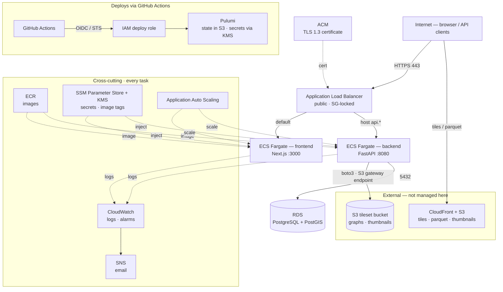

# Districtr v2 AWS Infrastructure

Pulumi (TypeScript) project that provisions and operates the AWS hosting for
Districtr v2: ECS Fargate services behind an Application Load Balancer, an RDS
PostgreSQL + PostGIS database, ECR, secrets in SSM, and CloudWatch alarms.
State lives in an S3 bucket and config secrets are encrypted with a KMS key —
there is no Pulumi Cloud dependency.

Two stacks, each a fully isolated copy (own VPC, ALB, database, services):
**`dev`** (deployed from the `dev` branch) and **`prod`** (deployed from
`main`).

Out of scope (not managed here): the S3 tileset bucket and CloudFront CDN,
Auth0, Sentry, DNS hosting, the data pipelines, and the CMS.

## Architecture



- Tasks run in public subnets with strict security groups (no NAT cost); only
  the ALB can reach them.
- RDS has no public IP; its security group admits only the backend tasks.
- Graph pickles stream from S3 per cache miss (free in-region via the S3
  gateway endpoint) into the backend's in-process LRU.

## AWS services

Every AWS service this project uses, what it does here, and where it's defined:

| Service | Role in Districtr | Defined in |
|---------|-------------------|------------|
| **VPC / EC2** | VPC, two public subnets (multi-AZ), internet gateway, route table, security groups (ALB / backend / frontend / RDS) | `network.ts` |
| **VPC S3 Gateway Endpoint** | Free in-region S3 access for graph reads and thumbnail writes — avoids NAT | `network.ts` |
| **Elastic Load Balancing (ALB)** | Public ingress: HTTPS listener, HTTP→HTTPS redirect, host routing (`api.*` → backend, default → frontend); `/metrics` and `/_debug/*` blocked from the internet | `alb.ts` |
| **Certificate Manager (ACM)** | DNS-validated TLS 1.3 certificate for the app + api domains | `alb.ts` |
| **ECS on Fargate** | Cluster, backend + frontend services and task definitions, plus a one-off `migrate` task definition | `cluster.ts`, `backend.ts`, `frontend.ts` |
| **Application Auto Scaling** | CPU target-tracking autoscaling for both ECS services | `backend.ts`, `frontend.ts` |
| **ECR** | Container image registry (immutable tags, scan-on-push, keep-last-20 lifecycle) | `ecr.ts` |
| **RDS** | PostgreSQL + PostGIS (gp3, encrypted, Multi-AZ on prod), Pulumi-generated password | `database.ts` |
| **SSM Parameter Store** | Secrets (SecureString) and `…/meta/*-image-tag` pointers, injected into task definitions | `backend.ts`, `frontend.ts` |
| **KMS** | Encrypts Pulumi config secrets (`alias/districtr-pulumi-secrets`) and the SSM SecureStrings | secrets provider, `scripts/bootstrap.sh` |
| **CloudWatch** | Log groups (backend / frontend / migrate), Container Insights (prod), metric alarms | `cluster.ts`, `monitoring.ts` |
| **SNS** | Alarm fan-out to email | `monitoring.ts` |
| **IAM** | ECS execution + task roles; GitHub OIDC provider and the `districtr-gha-deploy` role | `backend.ts`, `frontend.ts`, `scripts/bootstrap.sh` |
| **STS** | `AssumeRoleWithWebIdentity` for GitHub Actions OIDC deploys | deploy workflows |
| **S3** | Pulumi state-backend bucket; the backend task also reads/writes the existing tileset bucket | `scripts/bootstrap.sh` |

`index.ts` wires the modules together and exports `clusterName`,
`publicSubnetIds`, `backendSecurityGroupId`, `albDnsName`, `dbAddress`, and
`dnsRecords`.

**External (not managed here):** CloudFront + S3 (tiles / parquet / thumbnails),
DNS hosting, Auth0, Sentry.

## Configuration

Per-stack config lives in `Pulumi.{dev,prod}.yaml`. Non-secret values
(domains, CORS origins, Auth0 identifiers, task sizing) are plain text;
secrets (`secretKey`, Auth0 client/session secrets, optional OpenAI/reCAPTCHA)
are KMS-encrypted in the same file and safe to commit. Defaults per stack
(DB class, counts, log retention, etc.) live in `config.ts` and can be
overridden by setting the corresponding key.

## Deploys

Three GitHub Actions workflows (`.github/workflows/`), all AWS-OIDC
authenticated via the `districtr-gha-deploy` role:

- **AWS Infrastructure (Pulumi)** — `infra.yml`: `pulumi up` for the stack.
- **AWS Deploy API (Pulumi)** — `deploy-api.yml`: build → ECR → run alembic
  migrations as a one-off task → `pulumi up` → verify the service stabilized
  on the new image (a circuit-breaker rollback fails the run).
- **AWS Deploy App (Pulumi)** — `deploy-app.yml`: build → ECR → `pulumi up` →
  verify.

Mechanics:

- **Image tags** flow through SSM: each deploy pushes `:{git sha}` to ECR,
  writes the SHA to `/districtr/{stack}/meta/{backend,frontend}-image-tag`,
  then `pulumi up` reads it. Set `backendImageTag` / `frontendImageTag` in
  stack config to pin or roll back (config overrides SSM).
- **Gating**: workflows run only on `dev` / `main`. On push they require the
  repo variable `AWS_DEPLOY_DEV` / `AWS_DEPLOY_PROD` = `true`;
  `workflow_dispatch` runs on those branches without it. Other branches never
  run (and could not assume the deploy role regardless).
- **No PR preview**: a preview would execute PR code while holding the admin
  deploy role. Preview locally instead (below).
- Per-workflow concurrency groups + state-lock retry let a push touching
  backend + app + infra run all three, serialized on the S3 state lock.

## Operating it

Local preview and manual operations (read state; never auto-applied):

```bash
pulumi login 's3://districtr-v2-pulumi-state?region=us-east-2'
cd infra && npm ci && pulumi stack select dev
pulumi preview
pulumi stack output dnsRecords          # DNS records to create at the provider
pulumi stack output --show-secrets      # incl. DATABASE_URL for manual DB access
```

- **Rollback**: set `backendImageTag` / `frontendImageTag` to a known-good SHA
  and `pulumi up` (or re-run the deploy workflow for that SHA). ECR keeps the
  last 20 images.
- **Secrets**: `pulumi config set --secret <key> <value>` then `pulumi up`; the
  encrypted value is committed to the stack YAML and lands in SSM.
- **Database**: the password is Pulumi-generated; `pulumi stack output
  --show-secrets` exposes the `DATABASE_URL`. RDS is private — reach it from
  inside the VPC.

## Initial account setup

One-time, with admin credentials:

1. `GITHUB_REPO=<org>/districtr-v2 ./scripts/bootstrap.sh` — creates the S3
   state bucket, KMS key `alias/districtr-pulumi-secrets`, GitHub OIDC
   provider, deploy role `districtr-gha-deploy`, and seed SSM image-tag params.
2. GitHub repo **variables**: `AWS_DEPLOY_ROLE_ARN` (the role ARN the script
   prints), `API_URL_DEV` / `API_URL_PROD` (public API URLs),
   `AWS_DEPLOY_DEV` / `AWS_DEPLOY_PROD` (`true` to enable auto-deploy on push),
   optional `AWS_REGION` (defaults to `us-east-2`; must match the state bucket
   and stack region). Repo **secrets**: `SENTRY_AUTH_TOKEN`,
   `RECAPTCHA_SITE_KEY`, `NEXT_PUBLIC_MAPTILER_API_KEY`.
3. Initialize stacks and set secrets:
   ```bash
   pulumi login 's3://districtr-v2-pulumi-state?region=us-east-2'
   cd infra && npm ci
   pulumi stack init dev --secrets-provider='awskms://alias/districtr-pulumi-secrets?region=us-east-2'
   pulumi stack select dev
   pulumi config set --secret secretKey "$(openssl rand -hex 32)"
   pulumi config set --secret auth0SessionSecret "$(openssl rand -hex 32)"
   pulumi config set --secret auth0ClientId <...>
   pulumi config set --secret auth0ClientSecret <...>
   # optional: openaiApiKey, recaptchaSecretKey
   ```
   Fill the non-secret `Pulumi.{dev,prod}.yaml` values (domains, Auth0
   domain/audience/issuer, bucket, CDN URL).
4. First `pulumi up` pauses at ACM validation — create the validation CNAMEs
   from `pulumi stack output dnsRecords` at the DNS provider; the up completes
   once the certificate issues. Services crash-loop on the seed `bootstrap`
   image tag until the first deploy runs — harmless.
5. Enable deploys (`AWS_DEPLOY_DEV=true`) or run the workflows via
   `workflow_dispatch` to build images and roll the services. Create the
   app/api routing records (CNAME → ALB) from `dnsRecords` when ready to serve
   traffic. Apex domains need ALIAS / CNAME-flattening support at the provider.

## Cost

Dev ≈ $135–150/mo, prod ≈ $490–510/mo at default sizing. To trim dev: Fargate
Spot capacity provider, scheduled scale-to-zero off-hours, or smaller
`backendMemory` if the graph LRU allows. A Compute Savings Plan helps prod once
sizing settles.

## Known follow-ups

- Scope the deploy role down from AdministratorAccess.
- Pin GitHub Actions to commit SHAs and pin the Pulumi CLI version.
- ALB access logs + WAF; RDS parameter tuning (`work_mem` etc.) and log
  exports; ECS Exec on dev for shell access.
- Lifecycle policy for noncurrent versions on the Pulumi state bucket.
- ECR keeps only the last 20 images — a long-pinned rollback tag can expire.
